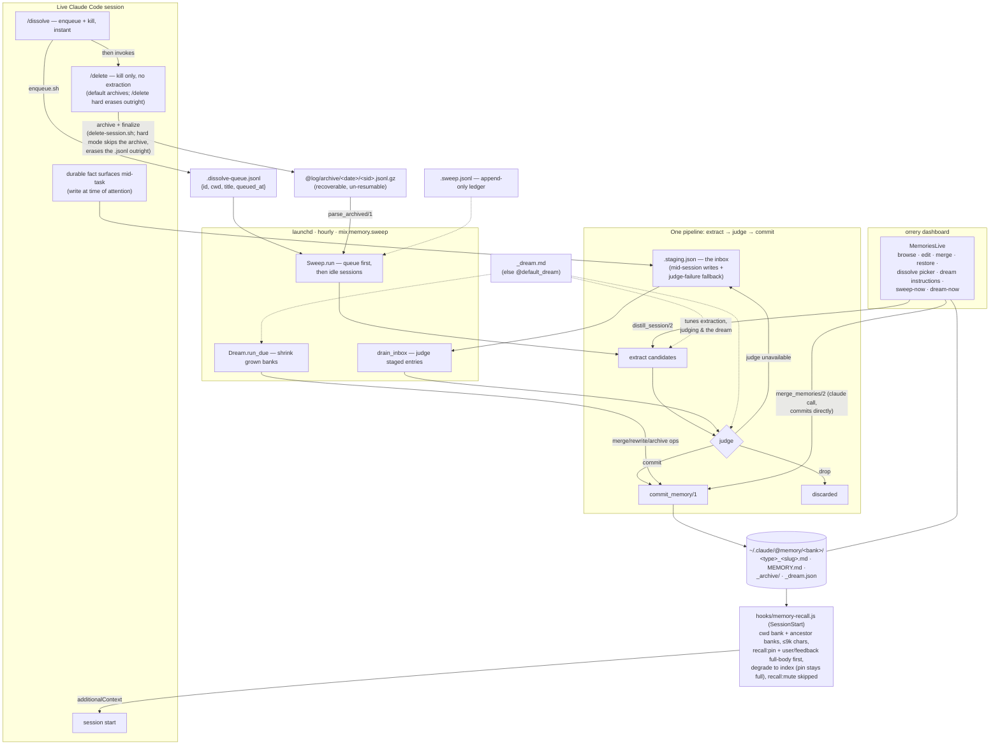
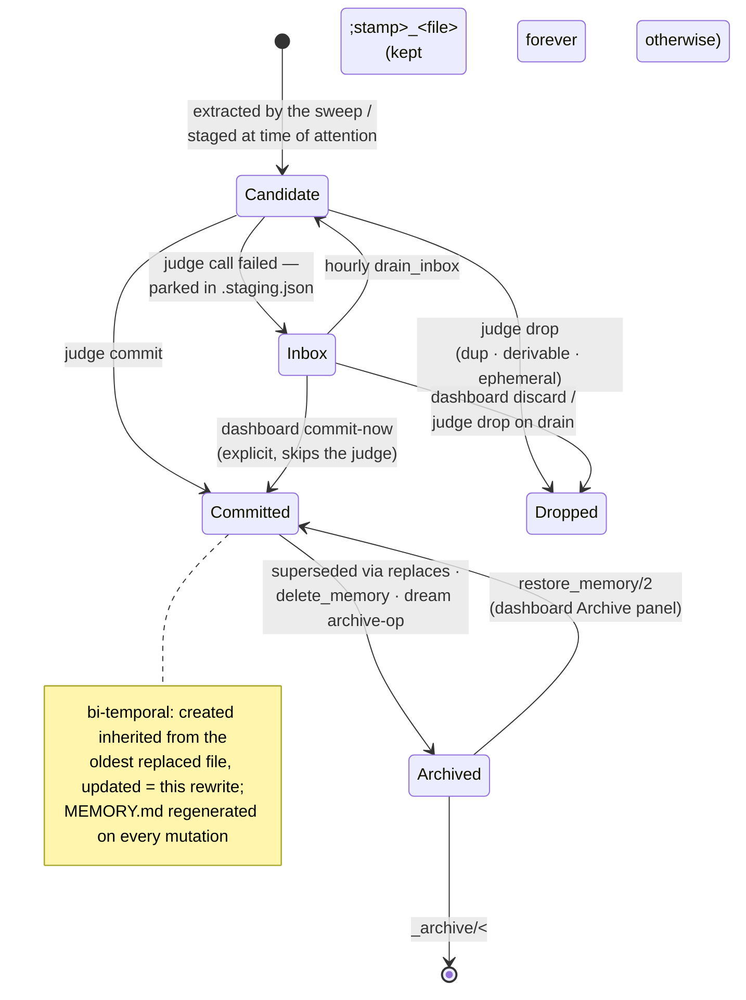
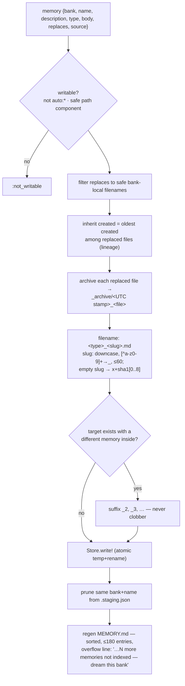
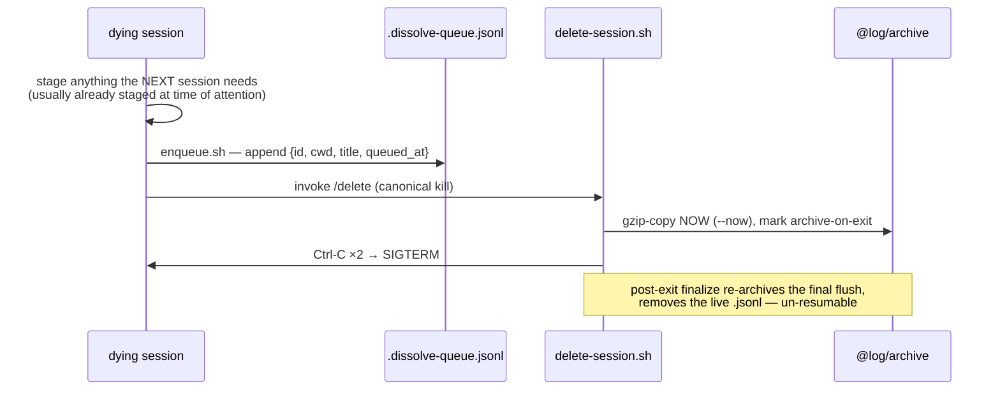
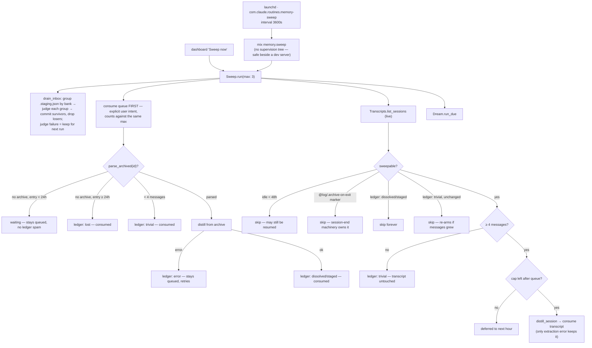
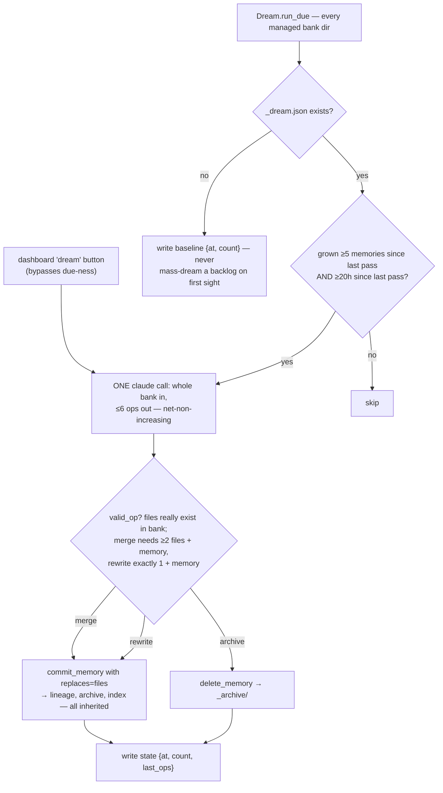
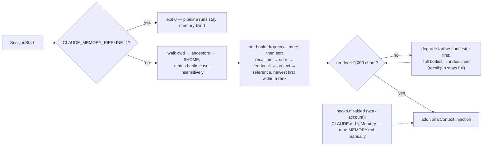
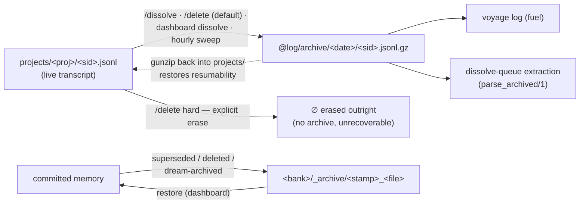

# The Memory System

One bank per working directory under `~/.claude/@memory`. Sessions read their bank back at
birth, write memories the moment they surface, and are **enqueued whole at death** —
`/dissolve` appends the session to the dissolve queue and kills it in milliseconds; all
extraction happens later, server-side, in the hourly sweep. There is exactly ONE
extraction pipeline (extract → judge → commit, all through `Orrery.Memory` — the single
format authority) and no human review anywhere: verification is a judge pass, and the
dashboard is a viewer/editor with manual triggers, never a gate.

## System map



Session end is deliberately dumb and fast: `/dissolve` = stage-anything-urgent + drain the
coding-standards queue + one queue append + `/delete`; `/delete` = archive + kill. No
claude call ever runs at session end. The sweep owns every extraction, so the skill-side
judge and `commit-memories.sh` mirror are gone — there is nothing left to drift.

## Life of a memory



Judge bars (`Orrery.Memory.judge/2`, read under the dream — the same curation guidance the
extractor followed): **durable** (useful in a future, unrelated session) · **non-derivable**
(not recoverable from code/git/CLAUDE.md) · **one idea per memory** · **description specific
enough to trigger recall**. Dedup runs against the existing memories' **full bodies** (not
titles) as a cascade, most decisive rule first: covered by an existing body → drop;
updates/corrects/subsumes → commit with those files in `replaces`; contradicts an existing
memory → the candidate is the newer observation, commit with the contradicted file in
`replaces`; otherwise genuinely new → commit. Tie-break: _when in doubt, drop_ — with no
reviewer downstream, a missed memory costs less than committed noise.

## Banks and memory files

Bank id = cwd with every non-alphanumeric character replaced by `-` (`sanitize/1`):
`/Users/jlg/GitHub/jgeschwendt/grove` → `-Users-jlg-GitHub-jgeschwendt-grove`.

```
~/.claude/@memory/
├── .dissolve-queue.jsonl             # sessions awaiting extraction (append-only producers)
├── .staging.json                     # inbox / fallback queue (array of memory maps)
├── .sweep.jsonl                      # append-only sweep ledger (newest line per session wins)
├── _dream.md                         # optional curation guidance (else @default_dream)
└── <bank>/
    ├── MEMORY.md                     # regenerated index — never hand-edited, ≤180 entries
    ├── <type>_<slug>.md              # one memory per file
    ├── _archive/<stamp>_<file>       # superseded/deleted memories — recoverable, restorable
    └── _dream.json                   # dream state {at, count, last_ops} (legacy fallback: _consolidation.json)
```

Underscore- and dot-prefixed entries are invisible to `read_dir/4` — archives and state
files never re-enter listings or the index.

Memory file serialization (`serialize_memory/1`):

```markdown
---
name: <human-readable title, ≤90 chars>
description: <one-line recall summary, whitespace collapsed>
type: feedback | project | reference | user
created: <ISO8601 — when the fact first became known; survives rewrites>
recall: <optional — pin | index | mute; absent = the recall hook's type policy>
source: <session uuid — omitted if unknown>
updated: <ISO8601 — this rewrite>
---

<body — for feedback/project: the rule, then **Why:**, then **How to apply:**>
```

## `commit_memory/1` — the single format authority



## The write paths

| Path                  | Extractor                            | Judge                          | Committer                  |
| --------------------- | ------------------------------------ | ------------------------------ | -------------------------- |
| `/dissolve` (skill)   | none — enqueues for the sweep        | —                              | —                          |
| sweep · queue entries | `claude -p` over archived transcript | 2nd `claude -p`                | `commit_memory/1`          |
| sweep · idle sessions | `claude -p` over live transcript     | same                           | same                       |
| dashboard dissolve    | same (`distill_session/2`)           | same                           | same                       |
| mid-session staging   | the live session (time of attention) | `drain_inbox` on next sweep    | same                       |
| dashboard merge       | `claude -p` merge prompt             | none — the click is the review | same, `replaces` = sources |
| dream (consolidation) | `claude -p` over the whole bank      | op validation (`valid_op?/2`)  | same / `delete_memory/2`   |

### Session end — `/dissolve` and `/delete`



`/delete` alone is the same minus the enqueue — the session had no value, no extraction is
spent on it. Recovering a queued-but-unwanted session: remove its line from the queue;
resuming an archived one: gunzip the archive back into `~/.claude/projects/<project>/`.
`/delete hard` skips the archive step entirely and erases the live `.jsonl` outright — nothing
to recover, and `/dissolve` never uses it (the archive is what the sweep reads).
(since 2026-07-19 · /delete hard)

## The hourly sweep



Idle-session contract: the transcript is consumed on **any successful extraction** —
including a clean zero and `staged` (candidates safe in the inbox). Only an extraction
_error_ preserves it. Quiescence replaces session-end hooks deliberately: hooks are
disabled in some sessions, and an end event can't shorten the idle wait anyway.

### One extraction call — `Orrery.Claude`

Every server-side claude call is `claude -p --output-format json --no-session-persistence
--setting-sources '' --disable-slash-commands --model sonnet --json-schema …` with
`CLAUDE_MEMORY_PIPELINE=1` exported — the recall hook exits and the SessionEnd hook
refuses under that flag, so pipeline runs can never feed the pipeline their own children,
and extraction is never biased by existing memories. Long conversations are flattened
(tool calls one-lined, subagent sidechains dropped) and capped at 60k chars (head +
tail kept, middle truncated).

## The dream (sleep-time consolidation)

Not the _voyage log_ (the page-per-day distiller that turns archived transcripts
into voyage-log pages) — this is the sleep-time pass that merges, rewrites, and archives to keep
a grown bank sharp.



## Recall (read path)



An optional `recall:` frontmatter key lets a single memory override the hook's type-based
render policy (`hooks/memory-recall.js`); absent, or any value outside the trio, falls back
to that policy:

- **`pin`** — always rendered full-body regardless of type, and sorted **first** (ahead of
  even `user`). It stays a full `### ` block even when its bank degrades to index mode, so
  the degraded bank emits the pinned memory's full body above its index lines.
- **`index`** — always rendered as a one-line index entry regardless of type (even
  `user`/`feedback`, which the type policy would otherwise render full).
- **`mute`** — skipped entirely: it never appears in full mode nor as an index line.

Recall latency note: a dissolved session's memories exist only after the next sweep run
(≤1 h). Anything the very next session must know is covered by write-at-attention staging
— that file is read by nothing but the pipeline, and commits drain it.

## Staging — an inbox, not a review queue

`.staging.json` has exactly two legitimate populations:

1. **Inbox** — memories written at the time of attention by live sessions (cheap, no
   ceremony mid-task). The hourly `drain_inbox` runs them through the judge, whatever
   bank they target.
2. **Fallback** — a server-side dissolve whose judge call failed parks its candidates
   here instead of losing them.

The dashboard shows staged entries with commit-now / discard buttons as an escape hatch to
_preempt_ the sweep — commit-now explicitly skips the judge. Entry shape mirrors
`read_staging/0`: `{bank, body, description, name, recall, replaces, source, type}` (recall
optional — `pin | index | mute`); malformed
entries (no name/bank) are dropped rather than allowed to crash a later commit. Banks that
exist only in staging still surface in listings.

## Bank kinds

| Kind    | Source                                                           | Writable            |
| ------- | ---------------------------------------------------------------- | ------------------- |
| managed | `~/.claude/@memory/<bank>/` — this system                        | yes (`writable?/1`) |
| `auto:` | Claude Code's own `projects/*/memory/` dirs                      | read-only           |
| seeded  | `skills/sandman/memories` corpus, copied once (`.seeded` marker) | as managed          |

Banks whose name starts with `_` or `.` are never targeted. `writable?/1` also rejects any
bank id that isn't a safe path segment, so a tampered request (`bank: "../.."`) can't
escape the memory root.

## The dashboard's role

MemoriesLive is a **viewer/editor with manual triggers** — never an approval step:

- browse banks (managed + read-only auto), live-reloading via `Orrery.Watcher` PubSub
- pipeline panel: pending dissolve-queue entries + the recent sweep ledger
- edit/save any memory (a save is a `commit_memory` with `replaces` = the original file)
- merge N selected memories (one claude call, commits directly, sources archived)
- dream the active bank on demand; run the whole sweep on demand
- dissolve any conversation from the picker — sessions active within the last hour are
  flagged and confirm first; sessions pre-marked archive-on-exit are excluded outright
- Archive panel per bank: browse `_archive/`, restore any entry
  (`restore_memory/2` — re-commit, then the archive entry is consumed)
- dream editor (`_dream.md` — the curation guidance every extraction follows)

## Retention



Memories are the durable residue; transcripts are compact-deleted (gzip-archived,
recoverable, un-resumable in place). The one exception is `/delete hard` — an explicit-intent
erase that removes the transcript outright, no archive copy, unrecoverable, and never feeds the
voyage log. (since 2026-07-19 · /delete hard)
