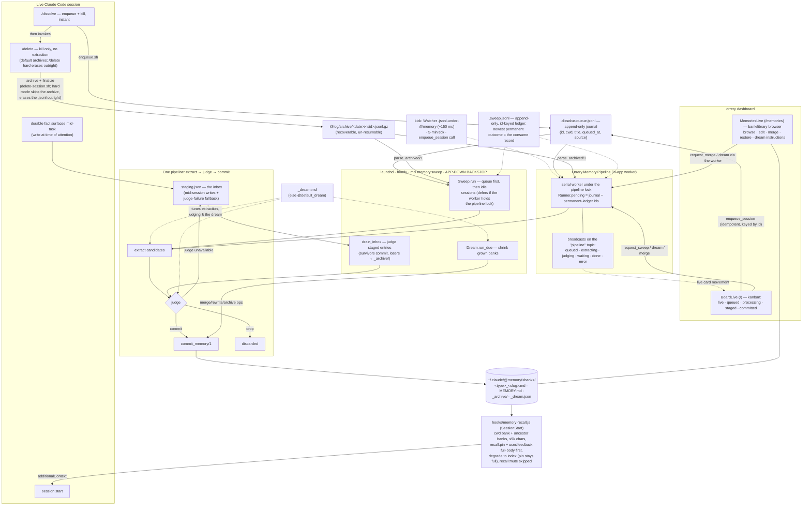
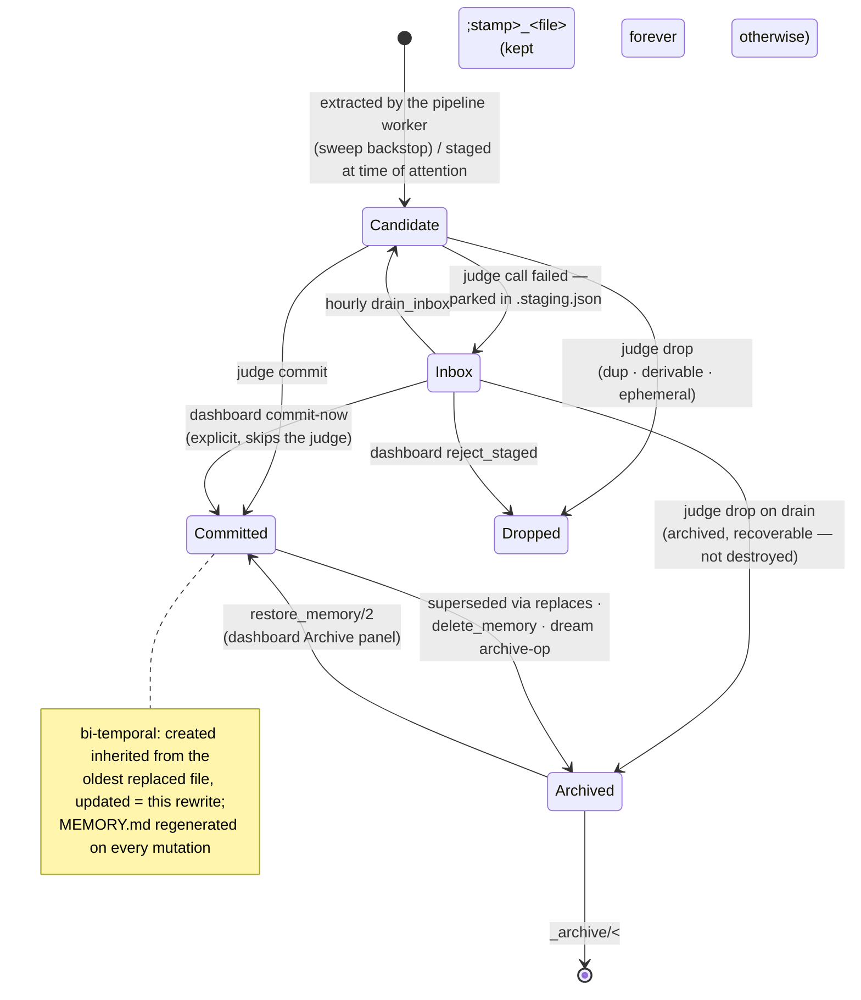
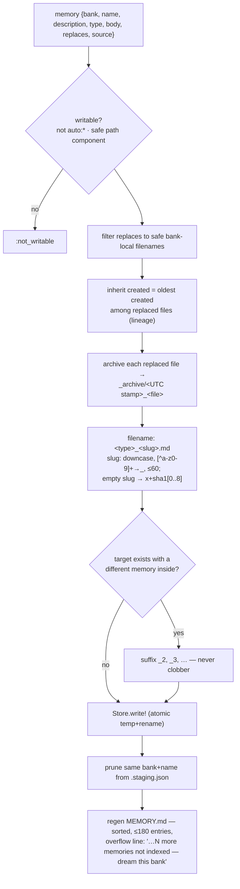
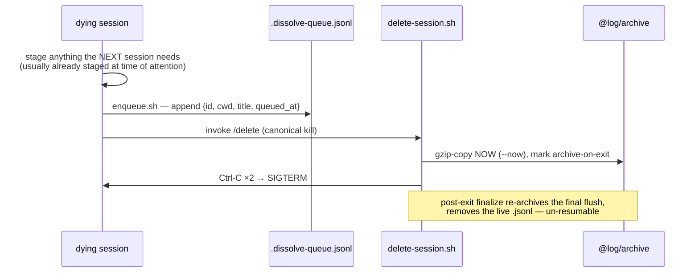
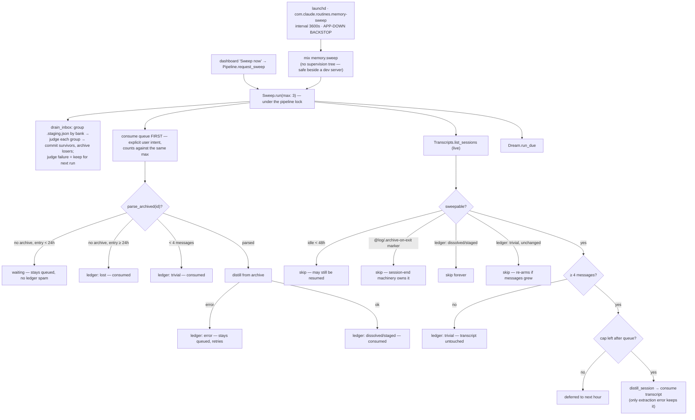
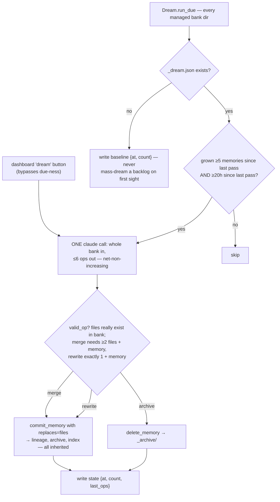
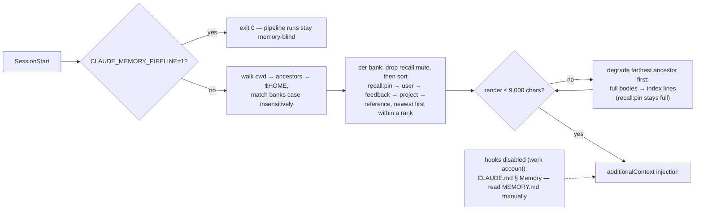
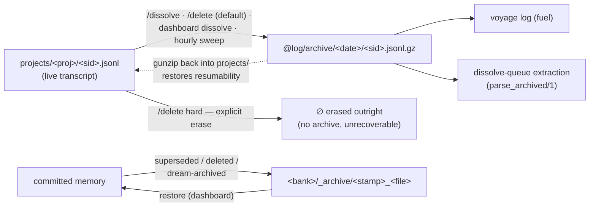

# The Memory System

One bank per working directory under `~/.claude/@memory`. Sessions read their bank back at
birth, write memories the moment they surface, and are **enqueued whole at death** —
`/dissolve` appends the session to the dissolve queue and kills it in milliseconds; all
extraction happens later, server-side. The in-app **`Orrery.Memory.Pipeline`** worker
drives the queue promptly (a `Watcher` kick picks up a shell `/dissolve` in ~150 ms; a
5-minute tick backs it up), and the hourly launchd sweep is demoted to the **app-down
backstop**. There is exactly ONE extraction pipeline (extract → judge → commit, all through
`Orrery.Memory` — the single format authority) and no human review anywhere: verification is
a judge pass, and the dashboard is a viewer/editor with manual triggers, never a gate.

## System map



Session end is deliberately dumb and fast: `/dissolve` = stage-anything-urgent + drain the
coding-standards queue + one queue append + `/delete`; `/delete` = archive + kill. No
claude call ever runs at session end. The in-app `Pipeline` worker owns prompt extraction
and the hourly sweep backs it up, so the skill-side judge and `commit-memories.sh` mirror
are gone — there is nothing left to drift.

## Life of a memory



Judge bars (`Orrery.Memory.judge/2`, read under the dream — the same curation guidance the
extractor followed): **durable** (useful in a future, unrelated session) · **non-derivable**
(not recoverable from code/git/CLAUDE.md) · **one idea per memory** · **description specific
enough to trigger recall**. Dedup runs against the existing memories' **full bodies** (not
titles) as a cascade, most decisive rule first: covered by an existing body → drop;
updates/corrects/subsumes → commit with those files in `replaces`; contradicts an existing
memory → the candidate is the newer observation, commit with the contradicted file in
`replaces`; otherwise genuinely new → commit. Tie-break: _when in doubt, drop_ — with no
reviewer downstream, a missed memory costs less than committed noise.

## The Pipeline worker

`Orrery.Memory.Pipeline` is the in-app GenServer that drains the dissolve queue promptly —
the sole in-app writer of the pipeline flow. LiveViews call **only** this module; the
launchd sweep is the app-down backstop.

**Prompt processing.** A kick — an `enqueue_session/3` call, the 5-minute tick, or a
`Watcher` event on a `.jsonl` write directly under `memory_root()` — makes the worker try
the **pipeline lock** non-blockingly. A held lock (the hourly sweep is mid-run) simply
defers; the next kick retries. After acquiring, it **re-derives** `Runner.pending/1` (closing
the worker↔sweep double-process window) and processes that snapshot one entry at a time in a
monitored `Task`, holding — and heartbeating — the lock across the whole batch. The shell
`/dissolve` append lands on disk, the Watcher fires within its 150 ms debounce, and the card
is in PROCESSING before the terminal has scrolled.

**Enqueue-only dashboard dissolve.** `enqueue_session(project, id, title)` guards the
request (`Store.component?` + not `marked_archive_on_exit?`), archives the live transcript
now (same semantics as `/dissolve` + `/delete` — extraction reads `parse_archived/1`
uniformly), appends ONE queue line (`source: "dashboard"`), and kicks. It is **idempotent,
keyed by session id**: an id already pending, in-flight, or permanently ledgered returns
`{:ok, :noop}` — a duplicate dissolve (a double-click, a replayed event) silently no-ops.
There is no cancel/toggle.

**The `"pipeline"` PubSub topic.** Every stage transition is broadcast so the board moves
cards live: `{:pipeline, id, :queued | :extracting | :judging | :waiting}`, then `{:pipeline,
id, {:done, %{outcome, bank, committed, staged, dropped}}}` (read back from the ledger, so it
fires only after the write lands) or `{:pipeline, id, {:error, reason}}`; the long jobs emit
`{:pipeline, :job, {:started | :finished, kind, info}}`, and the Watcher's own `{:pipeline,
:files_changed}` keeps the board honest against off-process writes.

**Jobs off the caller.** `request_sweep/0` / `request_dream/1` / `request_merge/2` run the
minutes-long claude passes in a supervised `Task` so a browser disconnect can't abort them;
each is refused with `{:error, :busy}` unless the worker is idle. This is how the board's
"sweep now" and MemoriesLive's merge/dream reach the pipeline.

**Crash safety needs no in-progress marker.** `Runner.process_entry/3` ledgers each outcome
itself, so a `Task` crash leaves no ledger line ⇒ the entry stays pending ⇒ it is
reprocessed on the next kick. The judge's dedup absorbs the bounded replay.

## Concurrency: the two locks

The running app and the launchd `mix memory.sweep` are **separate OS processes** contending
for the same files under `memory_root()`. `Orrery.Memory.Locks` serializes them with two
named `mkdir(2)` locks — `mkdir` is atomic on every POSIX filesystem, so exactly one caller
wins and everyone else gets `:eexist`. A crashed holder leaves its lock dir behind, so each
lock defines a staleness window after which a fresh caller steals it (the rmdir→mkdir steal
isn't itself atomic, but a losing racer just re-sees `:eexist` and re-checks — no lock is
ever double-held).

- **`.sweep.lock`** — the **pipeline lock** (name kept deliberately: renaming it would let an
  old process and a new one hold _different_ locks). Guards the long-held extraction / sweep
  / dream work. The holder heartbeats the lock's mtime every **60 s**; a lock untouched for
  **15 min** is presumed dead and stolen. The `Pipeline` worker takes it non-blockingly and
  heartbeats it on its own timer across a queue batch; `Sweep.run` and the dream/merge jobs
  take it via `Locks.with_lock(:pipeline, …)`, which spawns a linked heartbeat.
- **`.commit.lock`** — the **mutation lock** wrapping every short read-modify-write of the
  staging/bank files (`commit_memory`, `delete_memory`, `restore_memory`, `reject_staged`,
  the inbox drain's commit+archive, every `read_staging → write_staging` pair). Held for
  milliseconds, **never** across a claude call; acquisition spins with 10 ms backoff up to a
  ~5 s budget, then gives up with `{:error, :locked}`; a lock older than **60 s** is stolen.

**Ordering is pipeline → commit, never the reverse.** A holder that needs both takes the
pipeline lock first and releases in reverse; acquiring the pipeline lock while holding the
commit lock is the one ordering that could deadlock the app against the launchd sweep.

## Banks and memory files

Bank id = cwd with every non-alphanumeric character replaced by `-` (`sanitize/1`):
`/Users/jlg/GitHub/jgeschwendt/grove` → `-Users-jlg-GitHub-jgeschwendt-grove`.

```
~/.claude/@memory/
├── .dissolve-queue.jsonl             # append-only journal — never rewritten; pending is derived
├── .staging.json                     # inbox / fallback queue (array of memory maps)
├── .sweep.jsonl                      # append-only, id-keyed ledger; newest permanent outcome
│                                     #   per id = the consume record (inbox lines carry no id)
├── .sweep.lock/                      # pipeline lock (mkdir) — extraction/sweep/dream, 60s heartbeat
├── .commit.lock/                     # mutation lock (mkdir) — short staging/bank RMW
├── _dream.md                         # optional curation guidance (else @default_dream)
└── <bank>/
    ├── MEMORY.md                     # regenerated index — never hand-edited, ≤180 entries
    ├── <type>_<slug>.md              # one memory per file
    ├── _archive/<stamp>_<file>       # superseded/deleted memories — recoverable, restorable
    └── _dream.json                   # dream state {at, count, last_ops} (legacy fallback: _consolidation.json)
```

Underscore- and dot-prefixed entries are invisible to `read_dir/4` — archives and state
files never re-enter listings or the index.

Memory file serialization (`serialize_memory/1`):

```markdown
---
name: <human-readable title, ≤90 chars>
description: <one-line recall summary, whitespace collapsed>
type: feedback | project | reference | user
created: <ISO8601 — when the fact first became known; survives rewrites>
recall: <optional — pin | index | mute; absent = the recall hook's type policy>
source: <session uuid — omitted if unknown>
updated: <ISO8601 — this rewrite>
---

<body — for feedback/project: the rule, then **Why:**, then **How to apply:**>
```

## `commit_memory/1` — the single format authority



## The write paths

| Path                     | Extractor                                  | Judge                          | Committer                  |
| ------------------------ | ------------------------------------------ | ------------------------------ | -------------------------- |
| `/dissolve` (skill)      | none — enqueues for the worker             | —                              | —                          |
| dashboard dissolve       | none — `enqueue_session/3` (idempotent)    | —                              | —                          |
| worker · queue entries   | `claude -p` over the archived transcript   | 2nd `claude -p`                | `commit_memory/1`          |
| sweep · queue entries    | same (`Runner.process_entry/3`, backstop)  | same                           | same                       |
| sweep · idle sessions    | `claude -p` over the live transcript       | same                           | same                       |
| mid-session staging      | the live session (time of attention)       | `drain_inbox` on next sweep    | same                       |
| dashboard / worker merge | `claude -p` merge prompt                   | none — the click is the review | same, `replaces` = sources |
| dream (consolidation)    | `claude -p` over the whole bank            | op validation (`valid_op?/2`)  | same / `delete_memory/2`   |

### Session end — `/dissolve` and `/delete`



`/delete` alone is the same minus the enqueue — the session had no value, no extraction is
spent on it. Recovering a queued-but-unwanted session: remove its line from the queue;
resuming an archived one: gunzip the archive back into `~/.claude/projects/<project>/`.
`/delete hard` skips the archive step entirely and erases the live `.jsonl` outright — nothing
to recover, and `/dissolve` never uses it (the archive is what the sweep reads).
(since 2026-07-19 · /delete hard)

## The hourly sweep

The launchd sweep is now the **app-down backstop**, not the primary driver: when the app is
up, the `Pipeline` worker has already drained the queue, so the sweep either finds nothing
pending or defers on the pipeline lock (`Sweep.run` returns `:locked`). It still owns what the
worker doesn't — idle-session discovery, `drain_inbox`, and due dreams — and it is the only
path that runs at all when the app is down. It reaches the queue and the ledger through the
same `Orrery.Memory.Pipeline.Runner` the worker uses, so the two can never double-process an
entry.



Idle-session contract: the transcript is consumed on **any successful extraction** —
including a clean zero and `staged` (candidates safe in the inbox). Only an extraction
_error_ preserves it. Quiescence replaces session-end hooks deliberately: hooks are
disabled in some sessions, and an end event can't shorten the idle wait anyway.

**The launchd blind spot.** A `mix memory.sweep` runs in its own OS process with no PubSub —
it cannot broadcast `"pipeline"` events. The board therefore sees a sweep-run extraction only
as queued→resolved (never the intermediate extracting/judging), reconstructed from the
Watcher's `{:pipeline, :files_changed}` when the ledger and bank files land on disk. The
in-flight PROCESSING column is blind to off-process extraction by construction.

### One extraction call — `Orrery.Claude`

Every server-side claude call is `claude -p --output-format json --no-session-persistence
--setting-sources '' --disable-slash-commands --model sonnet --json-schema …` with
`CLAUDE_MEMORY_PIPELINE=1` exported — the recall hook exits and the SessionEnd hook
refuses under that flag, so pipeline runs can never feed the pipeline their own children,
and extraction is never biased by existing memories. Long conversations are flattened
(tool calls one-lined, subagent sidechains dropped) and capped at 60k chars (head +
tail kept, middle truncated).

## The dream (sleep-time consolidation)

Not the _voyage log_ (the page-per-day distiller that turns archived transcripts
into voyage-log pages) — this is the sleep-time pass that merges, rewrites, and archives to keep
a grown bank sharp.



## Recall (read path)



An optional `recall:` frontmatter key lets a single memory override the hook's type-based
render policy (`hooks/memory-recall.js`); absent, or any value outside the trio, falls back
to that policy:

- **`pin`** — always rendered full-body regardless of type, and sorted **first** (ahead of
  even `user`). It stays a full `### ` block even when its bank degrades to index mode, so
  the degraded bank emits the pinned memory's full body above its index lines.
- **`index`** — always rendered as a one-line index entry regardless of type (even
  `user`/`feedback`, which the type policy would otherwise render full).
- **`mute`** — skipped entirely: it never appears in full mode nor as an index line.

Recall latency note: a dissolved session's memories exist only after the pipeline processes
it — seconds when the app is up (the Watcher-kicked worker), or the next sweep run (≤1 h) as
the app-down backstop. Anything the very next session must know is covered by write-at-attention staging
— that file is read by nothing but the pipeline, and commits drain it.

## Staging — an inbox, not a review queue

`.staging.json` has exactly two legitimate populations:

1. **Inbox** — memories written at the time of attention by live sessions (cheap, no
   ceremony mid-task). The hourly `drain_inbox` runs each bank's group through the judge:
   survivors commit, judge-**dropped** entries are serialized into the bank's `_archive/`
   (recoverable via `restore_memory/2` — never destroyed), and a judge-call failure keeps the
   whole group for the next drain. Every drained bank appends a `source: "inbox"` audit line
   to `.sweep.jsonl` with **no top-level `id`** — the id-keyed ledger read skips it, so an
   inbox line is never mistaken for a session outcome. The return tags every entry seen
   (`outcomes: [%{bank, name, outcome}]`, one of `"committed" | "dropped" | "kept"`).
2. **Fallback** — a server-side dissolve whose judge call failed parks its candidates
   here instead of losing them.

The board's STAGED column shows staged entries with approve (commit-now, explicitly skips the
judge) / reject buttons as an escape hatch to _preempt_ the sweep. Entry shape mirrors
`read_staging/0`: `{bank, body, description, name, recall, replaces, source, type}` (recall
optional — `pin | index | mute`); malformed
entries (no name/bank) are dropped rather than allowed to crash a later commit. Banks that
exist only in staging still surface in listings.

## Bank kinds

| Kind    | Source                                                           | Writable            |
| ------- | ---------------------------------------------------------------- | ------------------- |
| managed | `~/.claude/@memory/<bank>/` — this system                        | yes (`writable?/1`) |
| `auto:` | Claude Code's own `projects/*/memory/` dirs                      | read-only           |
| seeded  | `skills/sandman/memories` corpus, copied once (`.seeded` marker) | as managed          |

Banks whose name starts with `_` or `.` are never targeted. `writable?/1` also rejects any
bank id that isn't a safe path segment, so a tampered request (`bank: "../.."`) can't
escape the memory root.

## The dashboard's role

The dashboard is a **viewer/editor with manual triggers** — never an approval step — split
across two LiveViews.

**`BoardLive` at `/`** is the kanban board. Five columns — **LIVE · QUEUED · PROCESSING ·
STAGED · COMMITTED** — and cards move live on `"pipeline"` events: a dissolve click (or a
shell `/dissolve`) sends a card from LIVE to QUEUED, the worker's stage events carry it
through PROCESSING (`extracting…` → `judging…`), and `{:done}` lands a ledger-backed outcome
card atop COMMITTED with the produced memory cards below. Every handler re-queries
`Pipeline.status/0` and re-partitions — **event-as-invalidation, snapshot-as-truth** — so a
replayed, duplicate, or missed event and a reconnect all converge on the same view; only the
LIVE column is a stream. Card actions are enqueue-only and idempotent: `dissolve` and `retry`
check `id ∉ pending` then `enqueue_session` / `kick` (a no-op either way), `delete` removes a
live transcript, and `sweep now` routes to `request_sweep`. A right-anchored **drawer** opens
a conversation's transcript (live → `parse_archived` fallback → "consumed" empty state) or the
shared staged-memory editor.

**`MemoriesLive` at `/memories`** is the bank/library browser: browse banks (managed +
read-only auto, live-reloading via `Orrery.Watcher` PubSub), edit/save any memory (a save is a
`commit_memory` with `replaces` = the original file), select and **merge** N memories, and
**dream** a grown bank — merge and dream both route through `Pipeline.request_merge` /
`request_dream` so the claude pass survives a browser disconnect. It also carries the per-bank
Archive panel (browse `_archive/`, `restore_memory/2` any entry) and the dream-instructions
editor (`_dream.md`, the curation guidance every extraction follows). Each bank's "N pending"
chip links to `/` for the dissolves in flight.

The `?dissolve=` URL param, the dissolve picker, and the inline `start_async` claude calls are
all **gone** — dissolve is enqueue-only everywhere, and the reconnect-replay bug it caused
with it.

## Retention



Memories are the durable residue; transcripts are compact-deleted (gzip-archived,
recoverable, un-resumable in place). The one exception is `/delete hard` — an explicit-intent
erase that removes the transcript outright, no archive copy, unrecoverable, and never feeds the
voyage log. (since 2026-07-19 · /delete hard)
